# Prediction model for NYC City Housing Listings
## Data Collection
Data for this project were collected using web scraping techniques from realtor.com. The dataset includes information on houses listed for sale from 2021 to 2024.
###  Number of records for each year
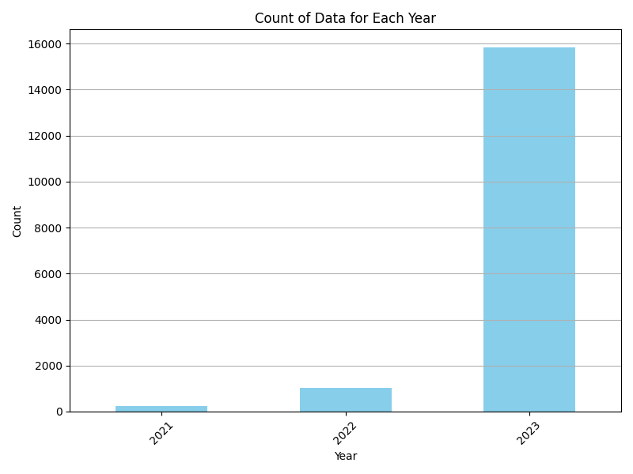

### Columns
['property_url', 'mls', 'mls_id', 'status', 'style', 'street', 'unit', 'city', 'state', 'zip_code', 'beds', 'full_baths', 'half_baths', 'sqft', 'year_built', 'days_on_mls', 'list_price', 'list_date', 'sold_price', 'last_sold_date', 'lot_sqft', 'price_per_sqft', 'latitude', 'longitude', 'stories', 'hoa_fee', 'parking_garage', 'primary_photo', 'alt_photos']

### Data shape after web scraping
(17088, 29)

## EDA
## Handling duplicated values
There were 364 duplicate values in the dataset which were removed.

### Handling null values
Before examining null values, irrelevant features were excluded from consideration for the project's objectives. Following this removal, the remaining features were assessed for the presence of null values.
| Feature          | Null Values |
|------------------|-------------|
| list_price       | 4           |
| street           | 14          |
| beds             | 636         |
| full_baths       | 748         |
| year_built       | 1758        |
| sqft             | 5845        |
| price_per_sqft   | 5846        |

After eliminating all null values, the dataset now has a shape of (10867, 14).

### Addressing outliers

The existing features in the dataset include:

- 'beds': Numerical
- 'full_baths': Numerical
- 'sqft': Numerical
- 'year_built': Numerical
- 'list_price': Numerical
- 'price_per_sqft': Numerical

To address skewness in the data, I applied a log transform to achieve a Gaussian distribution. Below, you can observe the data distribution both before and after the log transformation.

#### 'beds': Numerical
Skewness of original data: 4.739426354647343

Skewness of log-transformed data: 0.017194484194333386

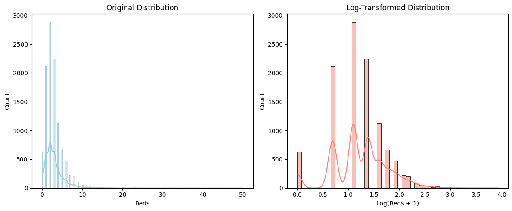

#### 'full_baths': Numerical
Skewness of original data: 9.743926203602364

Skewness of log-transformed data: 1.1508611341350268

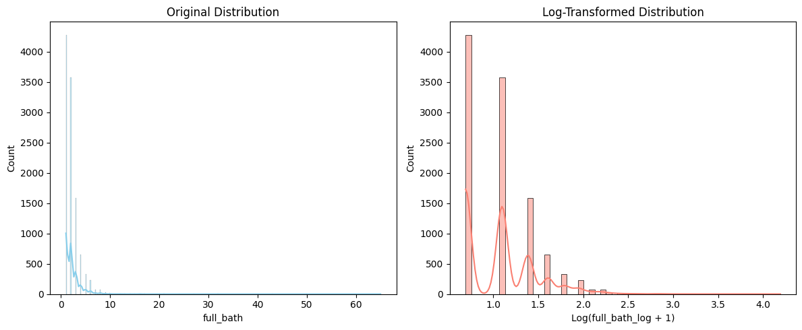

#### 'sqft': Numerical
Skewness of original data: 12.721288454241067

Skewness of log-transformed data: 0.6630027058848263

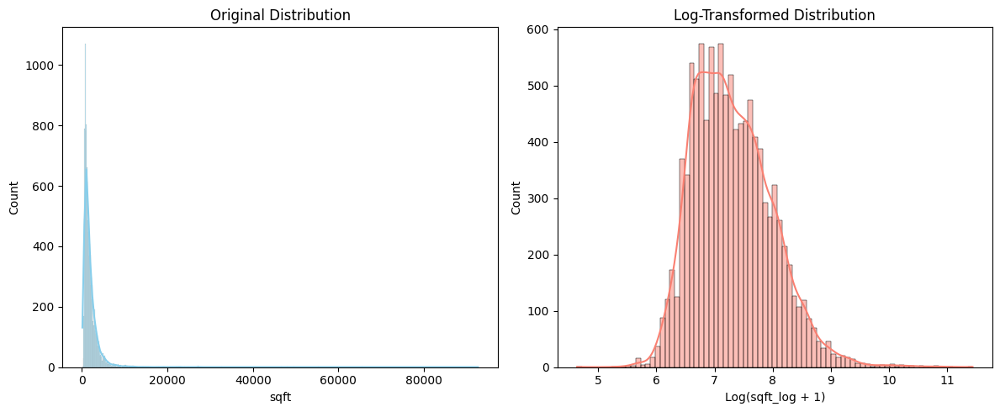

#### 'list_price': Numerical
Skewness of original data: 96.04967635617102

Skewness of log-transformed data: 0.6645397828927238

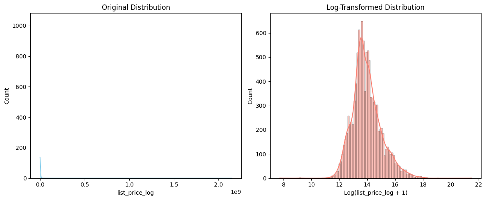

#### 'price_per_sqft': Numerical
Skewness of original data: 78.13892297168798

Skewness of log-transformed data: 0.27697626845400514

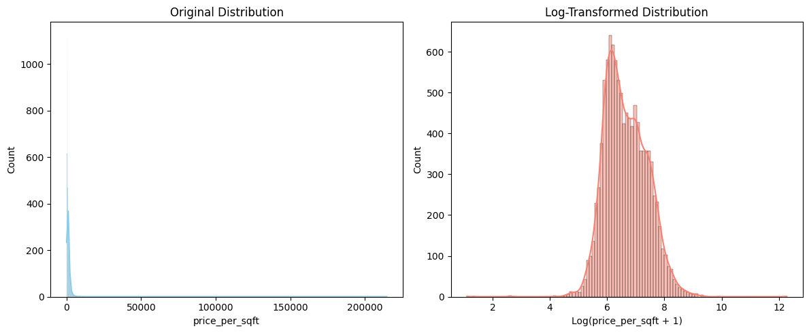

## Rescaling data for help ANN learn faster
As artificial neural networks (ANN) rely on gradient-based algorithms, it is advisable to rescale the data. In this context, the only feature requiring rescaling was the "year of build."

### Cities
This dataset encompasses information from 94 cities within NYC, with a shape of (10878, 6). The leading cities with the highest volume of "for sale" data include:

|  |  |
| --- | --- |
| city | count |
| Brooklyn | 2871 |
| New York | 2698 |
| Bronx | 1005 |
| Staten Island | 967 |
| Manhattan | 939 |
| Flushing | 492 |
| Queens | 241 |
| Forest Hills | 141 |
| Jamaica | 129 |
| Bayside | 83 |

To build a prediction model for housing price specifically for New York City, the dataset's limited size of 2698 records posed a challenge in building a reliable model. To overcome this problem, I implemented transfer learning, where an initial model was trained on the entire dataset which was 10878 records, and this pre-trained model was further utilized to train a new model exclusively incorporating data from New York City.

## Results and Output of the Models
I developed three different models to observe the variance in R2 which is a common metric to evaluate regression models.

1. Model trained on NYC city data
2. Model trained on all 94 cities of NYC state
3. Model trained on NYC city data with the help of transfred knowledge of Model 2
4. 
### NYC city model 
I constructed an Artificial Neural Network (ANN) model using the New York City dataset, which consisted of 2698 rows and 6 columns, including the 6 features mentioned earlier.

The neural network comprised 4 layers, and the hyperparameters were configured as follows:

- Activation function for hidden layers: relu
- Activation function for the output layer: linear
- Optimizer: Adam
- Learning rate: 0.0001
- Batch size: 32
- Epochs: 50
- Loss function: mean_squared_error

#### The evaluation metrics for this model included:

-Mean Squared Error (MSE): 0.45096153027927854
- Root Mean Squared Error (RMSE): 0.6715366931741545
- Mean Absolute Error (MAE): 0.538360731307571
- R-squared for test data (R²): 0.6508851410847962
- R-squared for train data(R²): 0.6327752621273862

#### The learning curve for NYC_city model
This learning curve is showing the change of Mean Squared Error 

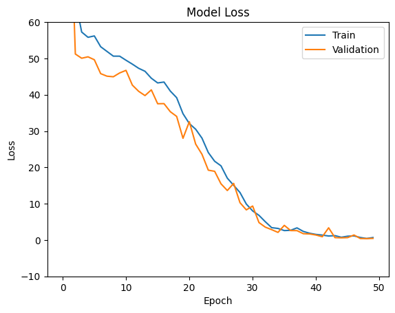

#### Regression line for NYC_city model
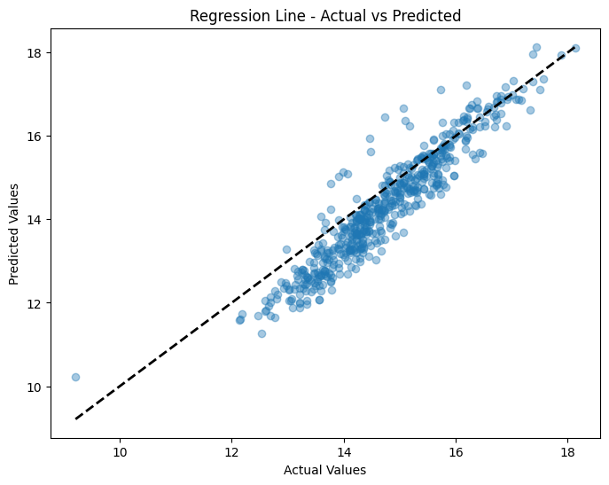

### All cities Model

**The hyperparamethers for this model:**

- Activation function for hidden layers: relu
- Activation function for output layer: linear
- learning rate: 0,001
- optimizer: adam
- epoch: 10
- batch size: 32
- loss: mean_squared_error

**The result for evaluation metrics of All_model:**

- Mean Squared Error (MSE): 0.13552753832605624
- Root Mean Squared Error (RMSE): 0.36814065019507997
- Mean Absolute Error (MAE): 0.29220021858898937
- R-squared for test data (R²): 0.8613360507658722
- R-squared for train data(R²): 0.8717035628502933

#### The learning curve for All_city model
This learning curve is showing the change of Mean Squared Error 

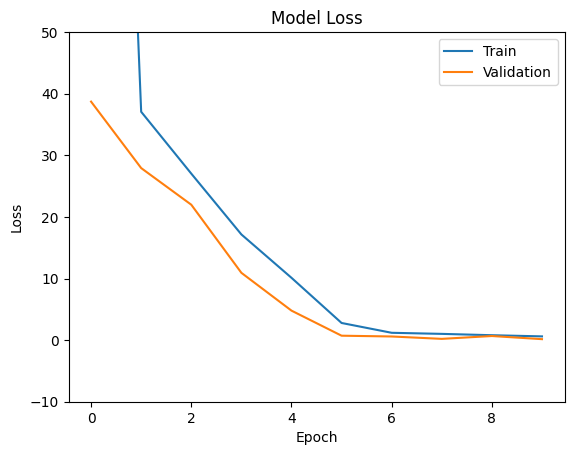

#### Regression line for All_city model
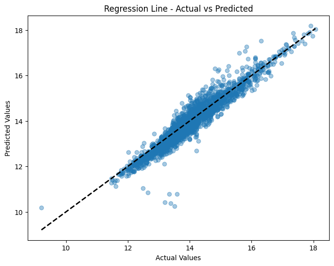

### Transfer learning Model

I preserved the model trained on 94 cities by removing the output layer and appending a new output layer while retaining the structure of the hidden layers.

The hyperparameters for this modified model were specified as follows:

- Activation function for the output: linear
- Learning rate: 0.0001
- Optimizer: Adam
- Epochs: 10
- Batch size: 32
- Loss function: mean_squared_error

**The result for evaluation metrics for TrasferLearning_Model:**

- Mean Squared Error (MSE): 0.10820972617796998
- Root Mean Squared Error (RMSE): 0.3289524679615126
- Mean Absolute Error (MAE): 0.24296718998881373
- R-squared for test data (R²): 0.9208797537443263
- R-squared for train data(R²): 0.9119134902631103

#### The learning curve for TrasferLearning_Model:
This learning curve is showing the change of Mean Squared Error 

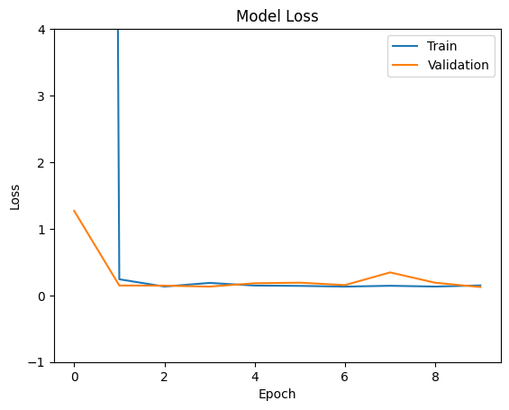

#### Regression line for TrasferLearning_Model:
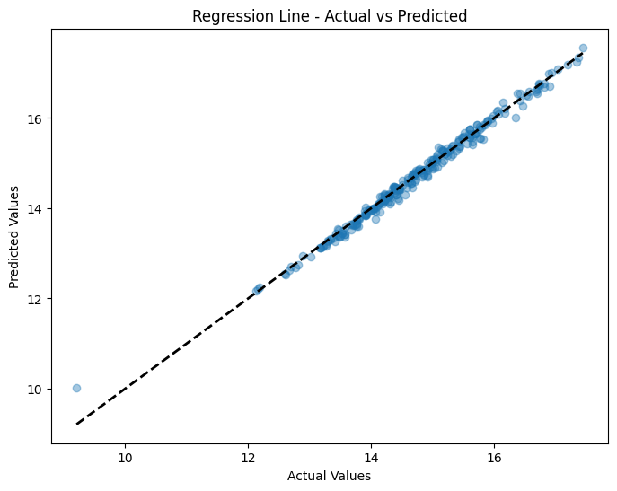

